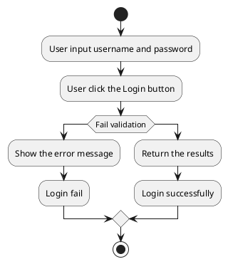
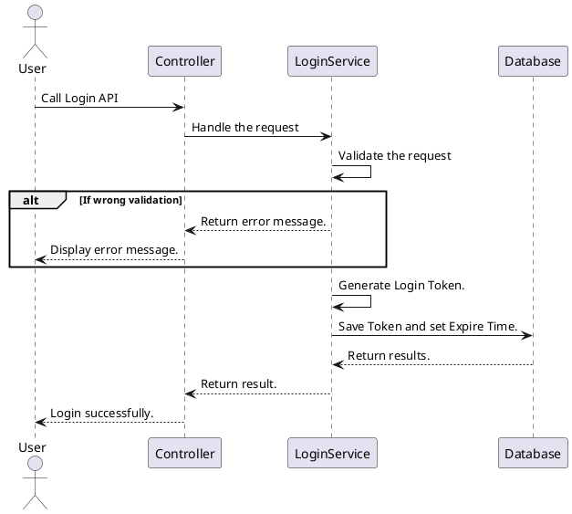

[TOC]

---
## Overview

## API Specification

| API        | URL             |
| ---------- | --------------- |
| POST       | /api/auth/login |
| Permission | N/A             |

## Request sample
```json
{
    "userName": "userName",
    "password": "password"
}
```

| Field    | Description                         | Data Type | Examples   |
| -------- | ----------------------------------- | --------- | ---------- |
| userName | The user name account need to login | string    | `userName` |
| password | The password of user name account   | string    | `password` |

## Response sample

```json
{
  "result": {
    "accessToken": "",
    "refreshToken": ""
  },
  "isSuccess": true,
  "statusCode": 200,
  "message": "Sign in successfully"
}
```

## Validation 

<table>
    <th>Status code</th>
    <th>Description</th>
    <th>Examples</th>
    <tbody>
        <tr>
            <td>400</td>
            <td>The user name is missing</td>
<td>

```json
{
  "result": null,
  "isSuccess": false,
  "statusCode": 400,
  "message": "userName is missing."
}
```
</td>
        </tr>
        <tr>
            <td>400</td>
            <td>The password is missing</td>
<td>

```json
{
  "result": null,
  "isSuccess": false,
  "statusCode": 400,
  "message": "password is missing."
}
```
</td>
        </tr>
                <tr>
            <td>400</td>
            <td>The incorrect user name or password</td>
<td>

```json
{
  "result": null,
  "isSuccess": false,
  "statusCode": 400,
  "message": "Incorrect username or password. Try again."
}
```
</td>
        </tr>
    </tbody>
</table>

## Activity Diagram



## Sequence Diagram

